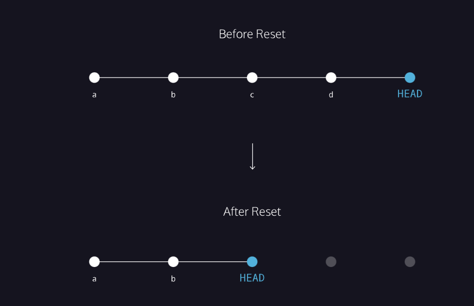

link to lesson:

https://www.codecademy.com/journeys/full-stack-engineer/paths/fscj-22-building-interactive-websites/tracks/fscj-22-git-and-github-part-i/modules/wdcp-22-important-git-operations-da30bb5a-8cd0-4294-b963-9841dd1c22db/lessons/git-backtracking/exercises/backtrack-review

### HOW TO BACKTRACK

## Generalizations

Congratulations! You’ve learned three different ways to backtrack in Git. You can use these skills to undo changes made to your Git project.

Let’s take a moment to review the new commands:

- git checkout HEAD filename: Discards changes in the working directory.
- git reset HEAD filename: Unstages file changes in the staging area.
- git reset commit_SHA: Resets to a previous commit in your commit history.

Additionally, you learned a way to add multiple files to the staging area with a single command:

