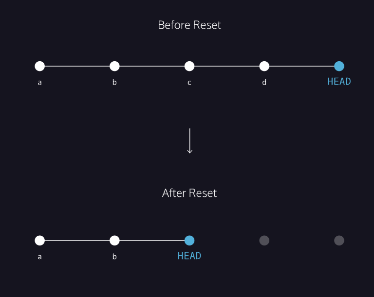

link to lesson:
https://www.codecademy.com/journeys/full-stack-engineer/paths/fscj-22-building-interactive-websites/tracks/fscj-22-git-and-github-part-i/modules/wdcp-22-important-git-operations-da30bb5a-8cd0-4294-b963-9841dd1c22db/lessons/git-backtracking/exercises/reset-review

### HOW TO BACKTRACK

## git reset review

To better understand git reset commit_SHA, notice the diagram on the right. Each circle represents a commit.

Before reset:

- HEAD is at the most recent commit

After resetting:

- HEAD goes to a previously made commit of your choice
- The gray commits are no longer part of your project
- You have in essence rewound the project’s history

